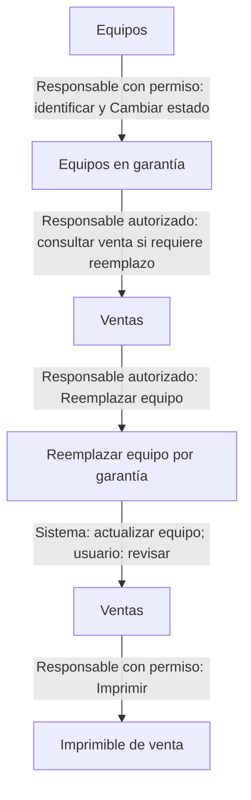
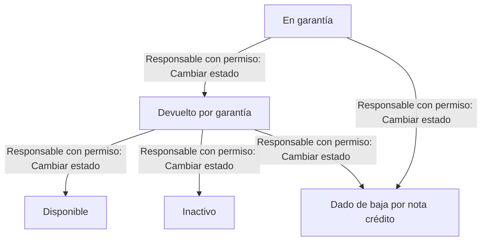

# Atender una garantía

Identifica el equipo, registra su seguimiento y, cuando corresponda, reemplázalo en la venta. El seguimiento y el reemplazo son acciones distintas.

> **Quién puede hacerlo:** Super Administrador, Administrador, Administrador de Punto y Vendedor consultan el seguimiento por su rol. Super Administrador, Administrador, Administrador de Punto y Bodeguero cambian estados dentro de su alcance; el Vendedor necesita **Cambiar el estado de un equipo**. Super Administrador y Administrador registran reemplazos por su rol. Otros usuarios necesitan **Registrar reemplazos por garantía**, sus requisitos y **Consultar ventas** efectivo para usar la ficha de la venta.

## Vista rápida

Este recorrido muestra dónde iniciar el seguimiento y dónde registrar un reemplazo si lo necesitas.

1. [Revisa la ficha del equipo](../inventario/equipo-detalle.md) — responsable de inventario.
2. [Inicia o sigue la garantía](../garantias/equipos-en-garantia.md) — usuario con permiso para cambiar estados; el Vendedor puede consultar sin hacer ese cambio.
3. Si corresponde, [reemplaza desde la venta](../garantias/equipos-en-garantia.md#cómo-reemplazar-el-equipo-de-una-venta) — responsable autorizado. También puedes reemplazar directamente un equipo Vendido: el sistema inicia su garantía.
4. [Revisa la venta](../ventas/ventas.md) y [reimprime su comprobante](../ventas/comprobante-de-venta.md) — usuario con los permisos correspondientes.

## Paso a paso

Comprueba el IMEI y distingue qué pasó con el equipo retirado de qué equipo identifica ahora la venta.

### 1. Identificar e iniciar el seguimiento

Revisa el IMEI en [Equipos](../inventario/equipos.md) y abre su [ficha](../inventario/equipo-detalle.md). Si necesitas iniciar el seguimiento de un equipo Vendido, quien tiene permiso cambia su estado a **En garantía**, con motivo. Consulta después [Equipos en garantía](../garantias/equipos-en-garantia.md).

Ese cambio manual no reemplaza el aparato de la venta ni modifica sus pagos. Si se hará un reemplazo directo desde la venta, no necesitas iniciar manualmente la garantía del equipo que sigue Vendido.

### 2. Preparar y registrar el reemplazo, si corresponde

Abre la [venta activa](../ventas/ventas.md) con **Consultar ventas** efectivo. Para registrar, necesitas además **Registrar reemplazos por garantía**, **Consultar reemplazos por garantía** y **Ver costo y ganancia** efectivos.

Comprueba que no haya anulación pendiente y que el equipo entrante esté activo, **Disponible**, en la sucursal de la venta, con la misma referencia y categoría, y sin otra venta activa. Si necesita llegar desde otra sede, completa primero su [traslado](../inventario/traslados.md).

Sigue [Reemplazar el equipo de una venta](../garantias/equipos-en-garantia.md#cómo-reemplazar-el-equipo-de-una-venta). Se registra directamente, sin solicitud de aprobación: el retirado queda En garantía si estaba Vendido, el entrante queda Vendido y la venta identifica al entrante.

### 3. Revisar la venta y entregar el comprobante

Consulta el nuevo equipo y el historial de reemplazos en [Ventas](../ventas/ventas.md), con los permisos de consulta correspondientes. La venta queda marcada para reimpresión; sigue [Comprobante de venta](../ventas/comprobante-de-venta.md).

El reemplazo conserva valor, costo y ganancia de la venta, pagos y caja. La diferencia de costo es informativa; no se cobra o paga automáticamente por ese registro. En una financiada, atiende el recordatorio de avisar a la financiera del cambio de IMEI: el sistema muestra el aviso, pero no lo registra por ti.

### 4. Continuar el seguimiento del equipo retirado

Quien tiene permiso registra los cambios que correspondan en [Equipos en garantía](../garantias/equipos-en-garantia.md#cómo-cambiar-el-estado). El siguiente diagrama muestra los destinos admitidos de este tramo con los nombres de fábrica; el catálogo puede tener nombres modificados.

- En garantía admite Devuelto por garantía o Dado de baja por nota crédito.
- Devuelto por garantía admite Disponible, Inactivo o Dado de baja por nota crédito.
- Dado de baja por nota crédito no tiene un siguiente estado en este recorrido.

El cambio manual valida el equipo y la transición; no comprueba la situación de la venta ni sus solicitudes. No sustituye el registro de un reemplazo ni la solicitud de anulación de una venta. Consulta [Cómo cambiar el estado](../garantias/equipos-en-garantia.md#cómo-cambiar-el-estado).

## Qué cambia en cada módulo

| Después de… | Inventario y garantías | Ventas | Caja | Metas e informes |
|---|---|---|---|---|
| Cambiar de Vendido a En garantía | Entra en seguimiento; continúa fuera de disponibilidad | No cambia el equipo asociado por ese cambio manual | No crea cobro ni devolución | El stock disponible excluye En garantía |
| Registrar reemplazo | Retirado En garantía; entrante Vendido | Identifica al entrante, conserva valores y marca reimpresión | Conserva pagos y movimientos | La venta sigue computable; el reemplazo no crea otra venta |
| Registrar siguiente estado | Actualiza el retirado según el recorrido permitido | No anula la venta por ese cambio | No hace una devolución de dinero | El stock actual refleja el estado consultado |

## Errores típicos del recorrido

- Si no hay equipo elegible, prepara el inventario o su traslado antes de registrar. **Reservado** no cumple el requisito del reemplazo.
- Si hay solicitud de anulación pendiente, resuélvela antes de reemplazar.
- Si no llegó confirmación o la venta ya tiene otro equipo, revisa su historial antes de repetir el reemplazo.
- Si necesitas anular la venta después, una garantía abierta del retirado puede impedirlo. Sigue [Modificar o anular una venta](modificar-o-anular-una-venta.md); cambiar un estado no sustituye ese trámite.
