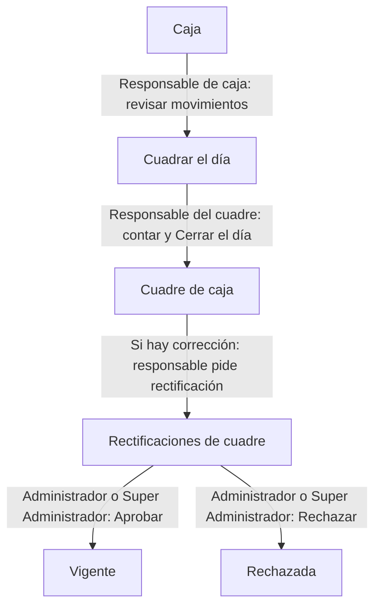

# Cuadre de caja del día

Revisa los movimientos, cuenta el efectivo y registra el cuadre de una sucursal. Si necesitas corregirlo después, encadena una rectificación con aprobación.

> **Quién puede hacerlo:** Super Administrador, Administrador y Administrador de Punto cierran por su rol. Vendedor y Bodeguero necesitan **Cuadres de caja** efectivo; consultar o registrar en Caja exige **Registrar y consultar movimientos de caja**. Super Administrador y Administrador resuelven rectificaciones. Una bodega pura no tiene cuadre.

## Vista rápida

El cierre inicial es directo; la aprobación se necesita para rectificar una revisión ya cerrada.

1. [Revisa Caja](../ventas/caja.md) y registra los movimientos pendientes — responsable de caja.
2. [Cuadra el día](../ventas/cuadres-de-caja.md) con el efectivo contado — responsable del cuadre.
3. [Pide rectificación](../ventas/solicitudes-de-cuadre.md), si necesitas corregir — responsable del cuadre.
4. [Resuelve la rectificación](../ventas/solicitudes-de-cuadre.md#cómo-aprobar-o-rechazar) — Super Administrador o Administrador. La aprobación crea otra revisión Vigente; el rechazo conserva la anterior.

## Paso a paso

Usa la sucursal y el día que quieres cerrar. El cuadre compara movimientos de ese día, no el saldo acumulado.

### 1. Revisar el libro del día

El responsable consulta [Caja](../ventas/caja.md) para revisar ventas, abonos y movimientos manuales. Registra los manuales pendientes sin repetir ingresos que la venta ya generó. Para corregir un manual, Super Administrador o Administrador usa su reverso; los ligados a una venta se corrigen por [Solicitudes de venta](modificar-o-anular-una-venta.md).

El **Saldo** de Caja es acumulado, aunque filtres el listado por fechas. Para el efectivo del día usa la vista de [Cuadrar el día](../ventas/cuadres-de-caja.md#cómo-preparar-y-cerrar-el-día).

### 2. Contar y cerrar

Quien tiene **Cuadres de caja** elige sucursal y fecha, revisa el desglose y registra el **Efectivo contado** siguiendo [Cuadres de caja](../ventas/cuadres-de-caja.md). Escribe lo contado físicamente, en pesos enteros no negativos; no copies el esperado para forzar diferencia cero.

Al confirmar, el sistema relee los movimientos de ese día y abre la ficha del cierre. La diferencia es contado menos esperado; un faltante o sobrante no impide el cierre. Esa revisión conserva sus cifras aunque entren movimientos después.

### 3. Pedir corrección sobre la revisión vigente

Si el contado estaba mal o hay movimientos posteriores del mismo día, abre el cuadre vigente y sigue [Pedir rectificación](../ventas/solicitudes-de-cuadre.md#cómo-pedir-la-rectificación). Revisa el contado propuesto y justifica la petición.

La solicitud queda **Pendiente**, conserva el cierre y no modifica movimientos de caja. No envíes otra sobre ese cuadre mientras haya una pendiente.

### 4. Resolver y revisar la nueva foto

Super Administrador o Administrador [aprueba o rechaza](../ventas/solicitudes-de-cuadre.md#cómo-aprobar-o-rechazar). El Administrador no aprueba su propia petición; el Super Administrador sí puede hacerlo.

Si se aprueba, abre **Revisión resultante**. El sistema vuelve a sumar los movimientos del **día original del cuadre**, usando el contado pedido. La revisión anterior queda Rectificada; la nueva queda Vigente. Si se rechaza, conserva el cierre anterior. Imprime o exporta la revisión que necesitas desde [su ficha](../ventas/cuadres-de-caja.md#cómo-imprimir-y-exportar-el-cuadre).

## Qué cambia en cada módulo

| Después de… | Caja | Cuadre de caja | Ventas |
|---|---|---|---|
| Registrar movimiento | Añade el registro de dinero | Puede participar en el cierre de su día | Un manual no crea una venta |
| Cerrar | Se consulta el libro del día | Guarda la primera revisión, contado y diferencia | No cambia la venta |
| Pedir rectificación | No altera movimientos | Conserva la revisión; crea petición Pendiente | No cambia la venta |
| Aprobar rectificación | Relee el día original sin agregar dinero | Crea otra revisión y conserva la anterior | No cambia la venta |

## Errores típicos del recorrido

- **«Cuenta el efectivo y escribe el total.»**: cuenta y completa Efectivo contado.
- Si el día ya tiene cuadre, abre el existente; no intentes cerrarlo otra vez.
- **«Ese cuadre ya fue rectificado: pide el cambio sobre la revisión vigente.»**: abre su revisión vigente.
- Si la confirmación de aprobación dice «releyendo el libro de hoy», comprueba la fecha del cuadre: se relee el día original, aunque sea anterior.
- Si no llegó confirmación, consulta cuadres o rectificaciones antes de reenviar.
