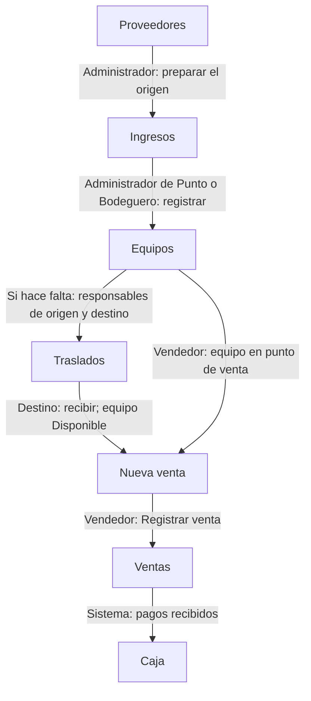

# Del ingreso de mercancía a la venta

Sigue una unidad desde la factura del proveedor hasta su venta y los ingresos de dinero que corresponden.

> **Quién puede hacerlo:** Super Administrador y Administrador preparan los datos de Administración. Ellos, el Administrador de Punto y el Bodeguero registran ingresos y gestionan traslados. Super Administrador, Administrador, Administrador de Punto y Vendedor registran ventas. Los permisos extra efectivos permiten otras participaciones dentro de la sede asignada.

## Vista rápida

El recorrido pasa por estas pantallas; Traslados se usa cuando la mercancía debe llegar a otra sede antes de venderse.

1. [Prepara el proveedor](../administracion/proveedores.md) — Super Administrador o Administrador.
2. [Registra el ingreso](../inventario/ingresos.md) y [revisa los equipos](../inventario/equipos.md) — responsable de inventario.
3. [Completa el traslado](../inventario/traslados.md), si hace falta — responsables de origen y destino.
4. [Registra la venta](../ventas/nueva-venta.md) y [consulta su ficha](../ventas/ventas.md) — quien atiende la venta.
5. [Revisa Caja](../ventas/caja.md) — responsable con acceso a caja; el sistema genera los ingresos por los pagos recibidos.

Las etiquetas de rol muestran un reparto habitual; los demás roles autorizados pueden hacer el mismo paso dentro de su alcance.

## Paso a paso

Avanza cuando estén listos los datos del paso siguiente. El ingreso crea las unidades; el traslado mueve las existentes; la venta registra la operación comercial.

### 1. Preparar la compra

Super Administrador o Administrador revisa el [proveedor](../administracion/proveedores.md), la [sucursal](../administracion/sucursales.md), las [referencias](../administracion/referencias.md) y las [categorías](../administracion/categorias-de-equipo.md). El formulario de ingreso ofrece opciones activas. Revisa también los [parámetros de precios](../inventario/precios.md): registrar un ingreso necesita una versión vigente.

Todavía no hay equipos nuevos por crear estos datos de apoyo.

### 2. Registrar y revisar las unidades

El responsable de inventario [registra el ingreso](../inventario/ingresos.md) con la factura y los IMEI. Al guardarlo, las unidades quedan **Disponibles** en la sede del ingreso. Comprueba sus datos en [Equipos](../inventario/equipos.md); no registres otra vez un IMEI para corregirlo.

El ingreso se guarda como conjunto. Si falla una unidad, no quedan guardadas las demás de ese envío.

### 3. Llevar el equipo al punto que venderá

Si ya está en el punto adecuado, continúa con la venta. Si está en otra sede o en una bodega pura, sigue [Traslados](../inventario/traslados.md): el responsable de origen crea y despacha; el de destino recibe.

Crear el traslado deja las unidades **En traslado**, aún en origen. Recibirlas cambia su ubicación a destino y las deja **Disponibles**. Espera esa recepción antes de vender desde el destino.

### 4. Registrar y comprobar la venta

Quien vende completa [Nueva venta](../ventas/nueva-venta.md) con el equipo, cliente, modalidad y pagos. Antes de confirmar, revisa el precio, el descuento y el total cubierto por los medios de pago.

Al registrarse, se abre la [ficha de la venta](../ventas/ventas.md). El equipo queda **Vendido** y el sistema registra ingresos de caja por las líneas de dinero recibido. **Financiación** y **Cartera propia** no generan ingreso inicial de dinero. El responsable de caja puede revisar esos movimientos en [Caja](../ventas/caja.md), sin duplicarlos manualmente. Para entregar el documento, sigue [Comprobante de venta](../ventas/comprobante-de-venta.md).

## Qué cambia en cada módulo

| Después de… | Inventario | Ventas | Caja | Metas e informes |
|---|---|---|---|---|
| Registrar ingreso | Crea equipos Disponibles en la sede | Aún no registra venta | El ingreso no registra el pago al proveedor en caja | El stock actual puede incluir las unidades |
| Crear y recibir traslado | Bloquea al crear; mueve a destino al recibir | La venta debe esperar disponibilidad | No registra cobros de venta | El stock se consulta en la ubicación actual |
| Registrar venta | Equipo Vendido | Conserva los datos usados al vender | Ingresos por pagos recibidos, con las excepciones indicadas | Aporta a las metas que coincidan y al tablero según alcance y filtros |

## Errores típicos del recorrido

- Si el IMEI ya existe, busca la unidad en [Equipos](../inventario/equipos.md) y revisa su origen; no vuelvas a ingresarla.
- Si ves **«Una bodega pura no registra ventas: traslada el equipo antes (6.2).»**, completa el traslado al punto que venderá.
- Si el equipo quedó En traslado, revisa el envío; crear o despachar no equivale a recibir.
- Si no llegó confirmación de la venta, busca en [Ventas](../ventas/ventas.md) antes de registrar otra vez. El formulario avisa: **«No se pudo confirmar si la venta quedó registrada. Revisa el historial de ventas antes de volver a intentar.»**
