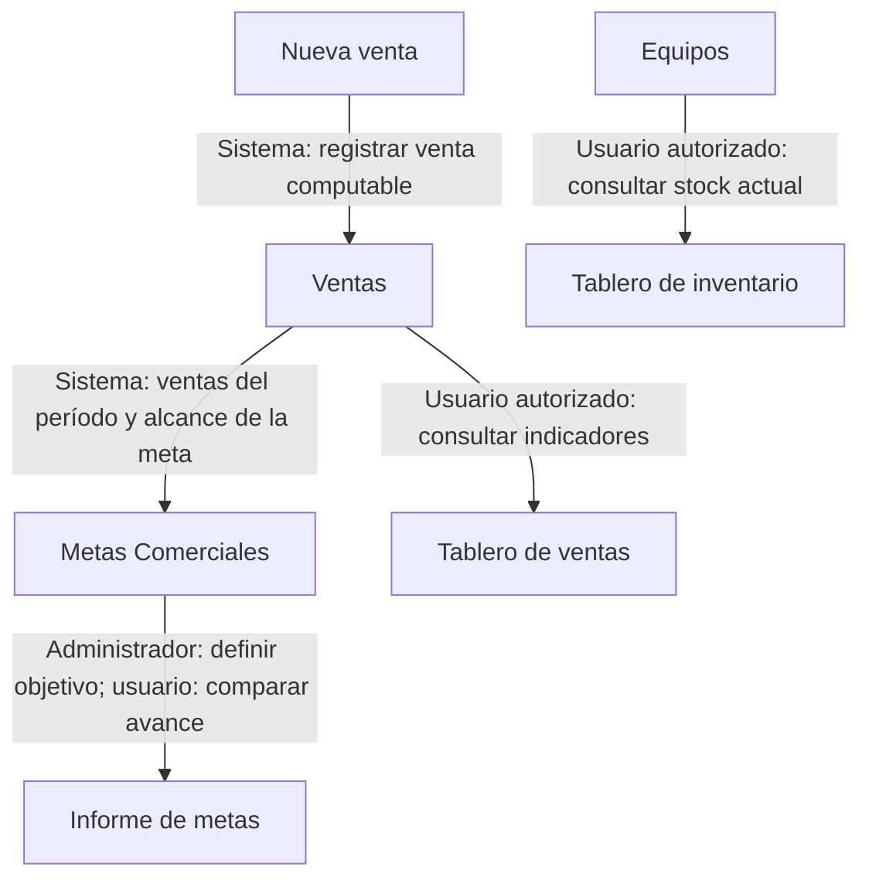

# Metas e informes

Define objetivos, registra las ventas que aportan y consulta el avance junto con los tableros. Compara cifras usando el período y el alcance de cada consulta.

> **Quién puede hacerlo:** Super Administrador y Administrador crean y gestionan metas. Ellos, Administrador de Punto y Vendedor consultan metas, el Informe de metas y el Tablero de ventas por su rol. El Tablero de inventario es de base para Super Administrador, Administrador y Administrador de Punto. El Bodeguero y otros usuarios pueden consultar con los permisos extra efectivos de cada pantalla; Inventario requiere además **Ver costo y ganancia**.

## Vista rápida

Las ventas alimentan el avance de las metas y el tablero; el inventario se consulta como stock actual.

1. [Define la meta](../metas/metas.md) — Super Administrador o Administrador.
2. [Registra ventas](../ventas/nueva-venta.md) y [consulta sus datos](../ventas/ventas.md) — quien vende.
3. [Consulta avance](../metas/metas.md#cómo-interpretar-el-avance) y [compara metas](../dashboard/informe-de-metas.md) — usuario autorizado.
4. [Consulta el Tablero de ventas](../dashboard/tablero-de-ventas.md) y, con acceso, [el Tablero de inventario](../dashboard/tablero-de-inventario.md) — usuario autorizado según su alcance.

La meta también puede contar ventas anteriores a su creación si pertenecen a su período; este orden es una guía de trabajo.

## Paso a paso

Revisa por separado la definición de la meta y la consulta que usas para compararla con ventas o stock.

### 1. Definir objetivo y alcance

Super Administrador o Administrador [crea la meta](../metas/metas.md#cómo-crear-una-meta) con período y objetivo en equipos, valor o ambos. Revisa los datos activos del alcance: empresa, sucursal, ciudad o trabajador, y marca o financiera cuando correspondan.

La definición no modifica las ventas. Si ya hubo ventas dentro del período y dimensiones elegidas, pueden aportar al avance desde la primera consulta.

### 2. Registrar ventas y consultar su aporte

Quien vende sigue [Nueva venta](../ventas/nueva-venta.md). Al consultar la meta, el sistema cuenta las ventas computables que coinciden con su período y dimensiones, y suma el valor vendido después del descuento, sin intermediación ni su IVA. No ingresas el avance a mano.

Para revisar las operaciones, usa [Ventas](../ventas/ventas.md). Una anulación aprobada retira el aporte del período original; una modificación puede cambiar el valor o la financiera considerados. Para tramitar correcciones, sigue [Modificar o anular una venta](modificar-o-anular-una-venta.md).

### 3. Comparar las metas visibles

Consulta [Metas Comerciales](../metas/metas.md) para una meta y [Informe de metas](../dashboard/informe-de-metas.md) para varias. El rango del informe selecciona metas cuyos períodos se cruzan con él; el avance usa el **período completo de cada meta**, no el fragmento del rango consultado.

Administrador de Punto consulta las activas de su sucursal y las individuales de su equipo actual. Vendedor consulta las activas de su sucursal y sus propias individuales. No compares una meta de sucursal con un tablero individual como si tuvieran el mismo alcance. El filtro **Financiera** requiere **Consultar entidades financieras** efectivo.

### 4. Contrastar ventas y existencias

En [Tablero de ventas](../dashboard/tablero-de-ventas.md), revisa período, filtros y alcance. El Vendedor ve sus propias ventas en su sucursal, aunque el listado de Ventas incluya las de sus compañeros. **Total vendido** no es necesariamente dinero recibido en caja.

Si tienes acceso, consulta [Tablero de inventario](../dashboard/tablero-de-inventario.md). Su stock corresponde al inventario actual; elegir el período de rotación no lo convierte en stock histórico. Así puedes revisar las existencias actuales junto con las ventas del período, sin confundir sus fechas.

Para guardar resultados, sigue la impresión o exportación de cada tablero. El **Informe de metas** imprime la página visible: pasa a las demás páginas si necesitas imprimirlas también.

## Qué cambia en cada módulo

| Después de… | Metas | Ventas y Caja | Dashboard e Informes | Inventario |
|---|---|---|---|---|
| Crear o editar meta | Define qué ventas aportan y contra qué objetivo | Conserva las ventas y sus movimientos | Consulta el avance con esa definición | Conserva los equipos |
| Registrar venta | Aporta si coincide con la meta | Registra venta y caja por pagos recibidos | La consulta incorpora ventas computables | Equipo Vendido; sale de disponibilidad |
| Aprobar anulación | Retira aporte del período original | Anula y contramueve la caja que corresponde | Retira esa venta del cómputo | Equipo actual vuelve a Disponible |
| Consultar o imprimir | No congela ni edita la meta | No cambia operaciones | Muestra el resultado consultado | Consulta stock actual sin modificarlo |

## Errores típicos del recorrido

- Si una meta no aparece, revisa período, estado, filtros y alcance. Los roles de sede no consultan metas deshabilitadas ni metas de empresa o ciudad fuera de su alcance.
- Si el avance parece sumar más días que el informe, revisa el período completo de la meta.
- Si una meta tiene objetivos en equipos y valor, los dos porcentajes redondeados a dos decimales deben llegar al 100 % para **Cumplida**. Por ese redondeo puede quedar un faltante pequeño aunque aparezca Cumplida; consulta [Cómo interpretar el avance](../metas/metas.md#cómo-interpretar-el-avance).
- Si ventas y caja no coinciden, compara valor vendido con dinero recibido: Financiación y Cartera propia no generan ingreso inicial de dinero.
- Si buscas existencias de una fecha anterior, el stock de este tablero sigue siendo actual; el período corresponde a rotación.
