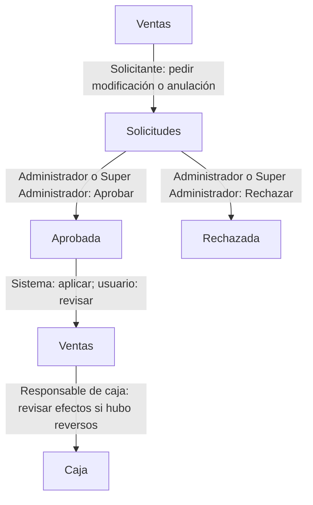

# Modificar o anular una venta

Encadena la petición, la revisión y la comprobación de sus efectos. Enviar una solicitud conserva la venta mientras se decide.

> **Quién puede hacerlo:** Super Administrador, Administrador, Administrador de Punto y Vendedor solicitan por su rol. Super Administrador y Administrador aprueban o rechazan. El Bodeguero puede solicitar con **Solicitar modificaciones y anulaciones** y sus requisitos efectivos.

## Vista rápida

La decisión se toma en Solicitudes; la venta y la caja se comprueban después de una aprobación.

1. [Abre la venta](../ventas/ventas.md) — solicitante.
2. [Envía y sigue la solicitud](../ventas/solicitudes.md) — solicitante; queda Pendiente.
3. [Aprueba o rechaza](../ventas/solicitudes.md#cómo-aprobar-o-rechazar) — Super Administrador o Administrador.
4. [Comprueba la venta](../ventas/ventas.md) y, si hubo cambios de pagos o anulación, [la caja](../ventas/caja.md) — usuario con acceso correspondiente. Un rechazo conserva la venta.

## Paso a paso

Separa lo propuesto de lo aprobado. El sistema vuelve a validar la operación al aprobarla.

### 1. Identificar qué debe cambiar

El solicitante revisa la venta activa en [Ventas](../ventas/ventas.md) y comprueba que no tenga otra solicitud pendiente. Si existe una, un Super Administrador o Administrador debe resolverla antes; un usuario de sede puede no verla si la abrió un compañero. Para corregir datos comerciales, cliente existente o medios de pago, sigue [Solicitar modificación](../ventas/solicitudes.md#cómo-solicitar-una-modificación). Para dejarla sin efecto, sigue [Solicitar anulación](../ventas/solicitudes.md#cómo-solicitar-una-anulación).

La modificación no cambia asesor, sucursal ni IMEI. Si necesitas reemplazar el equipo por garantía, sigue [Atender una garantía](atender-una-garantia.md).

### 2. Enviar y consultar la petición

El solicitante justifica y envía el cambio desde la ficha. Si el envío se confirma, consulta [Solicitudes](../ventas/solicitudes.md). La petición queda **Pendiente**: no devuelve el equipo al inventario ni contramueve la caja todavía.

Antes de crear una modificación se comprueban los pagos de la propuesta y el bloqueo para sustituirlos cuando hay abonos sin reversar. Si falla esa comprobación, no queda una petición creada: revisa [las restricciones del envío](../ventas/solicitudes.md#cómo-solicitar-una-modificación).

Los usuarios de sede consultan sus propias solicitudes dentro de su sede. Ver una venta de un compañero no da acceso a la solicitud de ese compañero.

### 3. Resolver con el rol autorizado

Super Administrador o Administrador revisa la propuesta y [resuelve la solicitud](../ventas/solicitudes.md#cómo-aprobar-o-rechazar). El Administrador necesita que otro administrador apruebe su propia petición; el Super Administrador puede aprobar la propia. Rechazar exige motivo y conserva la venta.

Para anular, el equipo actual debe seguir **Vendido**. La existencia de abonos de cartera propia bloquea la aprobación incluso si fueron reversados. Una garantía abierta de un equipo retirado por reemplazo puede bloquear tanto enviar la anulación como aprobarla; revisa ese proceso antes de continuar.

### 4. Comprobar el resultado entre módulos

Si se aprobó una modificación, revisa los nuevos datos en [Ventas](../ventas/ventas.md) y sigue [Comprobante de venta](../ventas/comprobante-de-venta.md) para reimprimir. Si sustituyó pagos, el sistema conserva las líneas anteriores y genera contramovimientos de su caja antes de emitir los ingresos de las nuevas líneas.

Si se aprobó una anulación, la venta queda anulada y deja de aportar a metas y al tablero de su período original. El equipo vuelve a **Disponible** en su ubicación, se limpia la Fecha de salida y se conserva la Fecha de ingreso. Los movimientos pendientes de reverso de la venta reciben contramovimientos. Revisa [Caja](../ventas/caja.md) con un rol autorizado.

## Qué cambia en cada módulo

| Después de… | Inventario | Ventas | Caja | Metas y tablero de ventas |
|---|---|---|---|---|
| Enviar o rechazar | Conserva el equipo | Conserva la venta; cambia la solicitud | Conserva movimientos | Conserva el aporte de la venta |
| Aprobar modificación | No sustituye el IMEI | Actualiza propuesta y marca reimpresión | Si sustituye pagos, contramueve y emite los nuevos ingresos | Recalcula con los datos comerciales que correspondan |
| Aprobar anulación | Equipo actual Disponible | Anulada; permanece para consulta | Contramovimientos de lo pendiente de reverso | Retira el aporte del período original |

Un contramovimiento es un registro del sistema. La devolución física del dinero requiere atender lo ocurrido con el cliente; consulta los registros antes de actuar.

## Errores típicos del recorrido

- **«Abriste esta solicitud: la aprueba otro administrador.»**: deja la aprobación a otro administrador.
- Si una anulación falla por abonos o garantía, revisa el impedimento; reversar un abono histórico no elimina el bloqueo de anulación.
- Si falla la aprobación del descuento o del pago, el aprobador puede rechazar con una explicación para que se rehaga la propuesta; no edita la solicitud desde su ficha.
- Los contramovimientos y los nuevos ingresos participan en el cuadre del día en que se registran, aunque la venta sea de un día anterior. Si ese día ya estaba cerrado, sigue [Rectificación de cuadre](../ventas/solicitudes-de-cuadre.md). Rectificar el día original de la venta no incorpora movimientos registrados en fechas posteriores.
