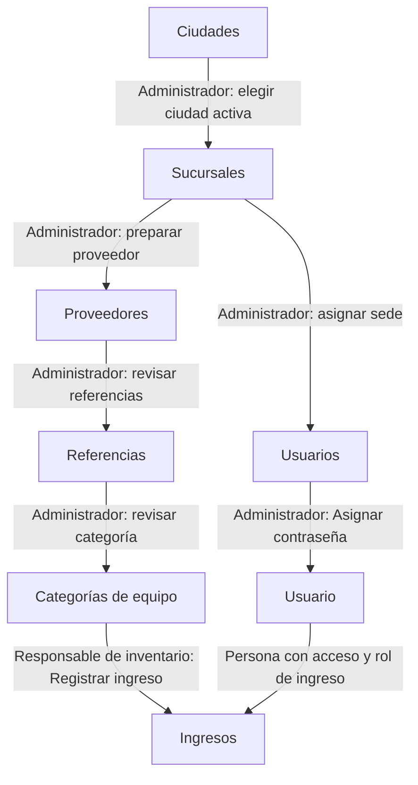

# Puesta en marcha de una sucursal

Prepara la sede, las personas y los datos de mercancía para registrar el primer ingreso. Si la sede venderá, revisa también la configuración comercial antes de su primera venta.

> **Quién puede hacerlo:** Super Administrador y Administrador preparan sucursales, usuarios y catálogos. El Administrador gestiona usuarios Administrador de Punto, Vendedor y Bodeguero; el Super Administrador también gestiona los roles administrativos y es quien otorga permisos extra. El primer ingreso lo registra uno de ellos, el Administrador de Punto o el Bodeguero, dentro de su alcance.

## Vista rápida

La sede es necesaria para asignar a su personal; la mercancía necesita además proveedor, referencias y categorías. Las flechas muestran ese orden de preparación, no altas automáticas.

1. [Prepara la ciudad](../administracion/ciudades.md) y [crea la sucursal](../administracion/sucursales.md) — Super Administrador o Administrador.
2. [Crea usuarios](../administracion/usuarios.md) y [asigna sus contraseñas](../administracion/usuario-detalle-y-permisos.md#asignar-una-contraseña) — administrador autorizado para esos roles.
3. Revisa [proveedores](../administracion/proveedores.md), [referencias](../administracion/referencias.md) y [categorías de equipo](../administracion/categorias-de-equipo.md) — Super Administrador o Administrador.
4. [Registra el primer ingreso](../inventario/ingresos.md) — responsable de inventario con acceso.

## Paso a paso

Si los datos de apoyo ya existen y están activos, reutilízalos. Crear una sede no crea por sí mismo su personal, mercancía ni ventas.

### 1. Registrar el lugar de trabajo

Super Administrador o Administrador revisa una [ciudad activa](../administracion/ciudades.md) y crea la [sucursal](../administracion/sucursales.md). Elige el **Tipo** según la operación: Punto de venta, Bodega o Punto de venta y bodega.

Una bodega pura recibe mercancía y traslados, pero no registra ventas, movimientos manuales de caja ni cuadres. Si venderás, usa el tipo correspondiente. **Responsable** es opcional: puedes dejarlo sin asignar al crear la sede y editarlo después de crear al personal.

### 2. Dar acceso a las personas

El administrador autorizado [crea los usuarios](../administracion/usuarios.md), con rol y sucursal. Administrador de Punto, Vendedor y Bodeguero necesitan sede asignada. Después abre cada ficha y [asigna la contraseña](../administracion/usuario-detalle-y-permisos.md#asignar-una-contraseña): crear la persona no le da una contraseña utilizable.

Si una tarea necesita permisos adicionales, el Super Administrador los [otorga con sus requisitos](../administracion/usuario-detalle-y-permisos.md#lista-completa-de-permisos-extra). No amplían el alcance de sede ni abren Administración a los roles de sede.

### 3. Preparar mercancía y configuración comercial

Super Administrador o Administrador revisa el [proveedor](../administracion/proveedores.md). Para los modelos, prepara primero [Marcas](../administracion/marcas.md), [Tipos de producto](../administracion/tipos-de-producto.md) y [Sistemas operativos](../administracion/sistemas-operativos.md), y luego [Referencias](../administracion/referencias.md). Revisa las [Categorías de equipo](../administracion/categorias-de-equipo.md) que se elegirán en el ingreso.

Comprueba los [Estados operativos](../administracion/estados-operativos.md) que usa el recorrido y una versión vigente de [Parámetros de precios](../inventario/precios.md). El Super Administrador publica nuevas versiones de parámetros cuando sea necesario.

Para un punto que venderá, revisa [Medios de pago](../administracion/medios-de-pago.md) y [Categorías de caja](../administracion/categorias-de-caja.md). Para ventas financiadas, revisa [Entidades financieras](../administracion/entidades-financieras.md). El Super Administrador atiende la tasa de intermediación, los [topes de descuento](../ventas/topes-de-descuento.md) y el [texto de aceptación](../ventas/texto-de-aceptacion.md) cuando necesiten nuevas versiones. Consulta esas páginas para distinguir configuración general de datos propios de la sede.

### 4. Registrar el primer ingreso y comprobar la sede

El responsable autorizado [registra el ingreso](../inventario/ingresos.md) con la factura y los IMEI. Las unidades quedan **Disponibles** en la sede seleccionada. Compruébalas en [Equipos](../inventario/equipos.md) desde el acceso de quien operará allí.

Si ingresaron en una bodega y se venderán en otro punto, continúa con [Del ingreso a la venta](del-ingreso-a-la-venta.md), que incluye el traslado y su recepción. No registres las mismas unidades otra vez al llegar al punto.

## Qué cambia en cada módulo

| Después de… | Administración y acceso | Inventario | Ventas y Caja |
|---|---|---|---|
| Crear sede | Queda disponible como ubicación | Aún no crea equipos | El Tipo condiciona si vende y maneja caja |
| Crear usuario y asignar contraseña | Registra persona, rol y sede; asigna acceso | Acota las operaciones de los roles de sede | No registra ventas ni dinero |
| Preparar catálogos y proveedor | Ofrece opciones en formularios | Aún no crea mercancía | Ofrece opciones comerciales según su uso |
| Registrar ingreso | Usa esos datos de apoyo | Crea unidades Disponibles en la sede | Todavía no registra una venta ni el pago de compra en caja |

## Errores típicos del recorrido

- Si una ciudad, sede, proveedor o referencia no aparece al elegir, revisa que esté activa en su página de Administración.
- **«Los roles Administrador de Punto, Vendedor y Bodeguero requieren una sucursal asignada.»**: completa la sede del usuario.
- Si la persona recién creada no puede entrar, comprueba que ya le asignaste contraseña desde su ficha.
- Si el ingreso falla por IMEI repetido, consulta el equipo existente. No anules y recrees datos para sortear esa validación.
- Si la sede es Bodega, prepara el traslado al punto de venta antes de vender.
